# Đặc Sản Sóc Trăng - Ecommerce Platform

## Giới thiệu

"Đặc Sản Sóc Trăng" là một dự án thương mại điện tử đầy đủ chức năng được xây dựng với MERN stack (MongoDB, Express, React, Node.js) và Next.js. Dự án bao gồm một trang web cho người dùng để duyệt và mua sản phẩm, và một trang quản trị để quản lý sản phẩm, đơn hàng, người dùng và các khía cạnh khác của cửa hàng.

## Tính năng chính

### Trang người dùng (Frontend - Next.js)

  * **Xác thực người dùng:** Đăng ký, đăng nhập, quên mật khẩu, xác thực OTP.
  * **Duyệt sản phẩm:** Xem sản phẩm mới nhất, bán chạy nhất, được xem nhiều nhất và có khuyến mãi cao nhất.
  * **Tìm kiếm và Lọc:** Tìm kiếm sản phẩm theo từ khóa, danh mục, khoảng giá, và xếp hạng.
  * **Chi tiết sản phẩm:** Xem thông tin chi tiết, hình ảnh, đánh giá và các sản phẩm liên quan.
  * **Giỏ hàng:** Thêm, cập nhật số lượng, và xóa sản phẩm khỏi giỏ hàng.
  * **Thanh toán:**
      * Xem trước đơn hàng với địa chỉ, phương thức vận chuyển, voucher và điểm tích lũy.
      * Hỗ trợ thanh toán khi nhận hàng (COD) và thanh toán qua MoMo.
  * **Quản lý đơn hàng:** Theo dõi trạng thái đơn hàng, xem lịch sử đơn hàng, và yêu cầu hủy hoặc trả hàng.
  * **Tài khoản người dùng:** Cập nhật thông tin cá nhân, quản lý địa chỉ, xem lịch sử mua hàng, và các sản phẩm đã xem.
  * **Tính năng tương tác:** Thêm sản phẩm vào danh sách yêu thích, để lại đánh giá cho sản phẩm.
  * **Tương tác bài viết:** Xem, thích, bình luận, chia sẻ.
  * **Hệ thống điểm tích lũy:** Tích điểm sau mỗi đơn hàng thành công và sử dụng điểm để được giảm giá.
  * **Voucher:** Khám phá, lưu và áp dụng voucher.
  * **Chat trực tuyến:** Hỗ trợ khách hàng theo thời gian thực.
  * **Chat với AI:** Hỗ trợ khách hàng bằng trợ lý ảo.

### Trang quản trị (Admin - React)

  * **Dashboard:** Tổng quan về doanh thu, người dùng mới, và các đơn hàng gần đây.
  * **Quản lý người dùng:** Xem, tìm kiếm, và thay đổi trạng thái hoạt động của người dùng.
  * **Quản lý sản phẩm:** Thêm, sửa, xóa sản-phẩm với hình ảnh và thông tin chi tiết.
  * **Quản lý đơn hàng:** Xem chi tiết đơn hàng, cập nhật trạng thái, và xử lý các yêu cầu hủy/trả hàng.
  * **Quản lý danh mục:** Tạo và quản lý các danh mục sản phẩm.
  * **Quản lý voucher:** Tạo và quản lý các mã giảm giá.
  * **Kiểm duyệt bình luận:** Kiểm duyệt thủ công hoặc tự động.
  * **Quản lý bài viết:** Đăng bài, quản lý SEO, thống kê lượt thích, bình luận, chia sẻ.
  * **Quản lý phương thức vận chuyển:** Cấu hình các tùy chọn giao hàng.
  * **Hệ thống thông báo:** Nhận thông báo về đơn hàng mới và các hoạt động quan trọng khác.
  * **Chat với khách hàng:** Tương tác và hỗ trợ khách hàng trực tiếp từ trang quản trị.

## Công nghệ sử dụng

**Backend:**

  * Node.js
  * Express
  * MongoDB
  * Mongoose
  * JSON Web Token (JWT)
  * Socket.IO (cho tính năng chat)
  * Nodemailer (để gửi email)
  * Cloudinary (lưu trữ hình ảnh)

**Frontend (Người dùng):**

  * Next.js
  * React
  * TypeScript
  * Tailwind CSS
  * Auth.js (xác thực)
  * shadcn/ui (component library)
  * SWR (data fetching)

**Frontend (Quản trị):**

  * React
  * Vite
  * Redux Toolkit (quản lý state)
  * React Bootstrap
  * Chart.js (biểu đồ)
  * Socket.IO Client

**Công cụ phát triển:**

  * Postman (test API)
  * concurrently (chạy nhiều script cùng lúc)

## Cấu trúc dự án

Dự án được tổ chức thành ba phần chính: backend, frontend cho người dùng (feUser), và frontend cho trang quản trị (feAdmin).

```
minhtrung9443-btnhom_ccnphm/
├── be/                   # Backend (Node.js, Express)
│   ├── src/
│   │   ├── controllers/  # Xử lý request và response
│   │   ├── middlewares/  # Middleware cho authentication, error handling
│   │   ├── models/       # Định nghĩa schema cho MongoDB
│   │   ├── routes/       # Định tuyến API
│   │   └── services/     # Logic nghiệp vụ
│   └── index.js          # Entry point của server
├── feAdmin/              # Frontend trang quản trị (React, Vite)
│   ├── src/
│   │   ├── components/   # Các component tái sử dụng
│   │   ├── pages/        # Các trang của ứng dụng
│   │   ├── redux/        # Quản lý state với Redux Toolkit
│   │   └── services/     # Gọi API từ backend
│   └── main.jsx          # Entry point của ứng dụng React
└── feUser/               # Frontend trang người dùng (Next.js)
    ├── src/
    │   ├── app/          # App Router của Next.js
    │   ├── components/   # Các component React
    │   ├── contexts/     # React Context (ví dụ: CartContext)
    │   ├── hooks/        # Các custom hook
    │   └── services/     # Gọi API từ backend
    └── next.config.ts    # Cấu hình Next.js
```
## Cơ sở dữ liệu

```mermaid
erDiagram
  Article {
    String title "(required)"
    String slug "(unique)"
    ObjectId author "(required, FK to User)"
    String content "(required)"
    String excerpt
    String featuredImage
    String[] images
    String status
    String[] tags
    Date publishedAt
    Date scheduledAt
    String seoMeta_title
    String seoMeta_description
    String[] seoMeta_keywords
    Number stats_views
    Number stats_likes
    Number stats_comments
    Number stats_shares
    ObjectId _id
    Date createdAt
    Date updatedAt
  }
  ArticleLike {
    ObjectId article "(required, FK to Article)"
    ObjectId user "(required, FK to User)"
    ObjectId _id
    Date createdAt
    Date updatedAt
  }
  ArticleShare {
    ObjectId article "(required, FK to Article)"
    ObjectId user "(FK to User)"
    String platform "(required)"
    Date sharedAt
    ObjectId _id
    Date createdAt
    Date updatedAt
  }
  Cart {
    ObjectId userId "(required, unique, FK to User)"
    object[] items
    ObjectId _id
    Date createdAt
    Date updatedAt
  }
  Category {
    String name "(required, unique)"
    String description
    Boolean isActive
    ObjectId _id
    Date createdAt
    Date updatedAt
  }
  ChatMessage {
    ObjectId roomId "(required, FK to ChatRoom)"
    ObjectId senderId "(required, FK to User)"
    String senderRole "(required)"
    String message "(required)"
    ObjectId _id
    Date createdAt
    Date updatedAt
  }
  ChatRoom {
    ObjectId userId "(required, FK to User)"
    String lastMessage
    Date lastMessageTimestamp
    String status
    Number userUnreadCount
    Number adminUnreadCount
    ObjectId _id
    Date createdAt
    Date updatedAt
  }
  Comment {
    ObjectId article "(required, FK to Article)"
    ObjectId author "(required, FK to User)"
    String content "(required)"
    ObjectId parentComment "(FK to Comment)"
    Number level
    String status
    Boolean isEdited
    Date editedAt
    Number likes
    ObjectId _id
    Date createdAt
    Date updatedAt
  }
  CommentLike {
    ObjectId comment "(required, FK to Comment)"
    ObjectId user "(required, FK to User)"
    ObjectId _id
    Date createdAt
    Date updatedAt
  }
  Delivery {
    String type "(required)"
    String name "(required)"
    Number price "(required)"
    String description "(required)"
    Number estimatedDays "(required)"
    ObjectId _id
    Date createdAt
    Date updatedAt
  }
  Favorite {
    ObjectId userId "(required, FK to User)"
    ObjectId productId "(required, FK to Product)"
    ObjectId _id
    Date createdAt
    Date updatedAt
  }
  LoyaltyPoints {
    ObjectId userId "(required, FK to User)"
    Number points "(required)"
    String transactionType "(required)"
    String description "(required)"
    ObjectId orderId "(FK to Order)"
    Number pointsValue
    Date expiryDate
    Mixed metadata
    ObjectId _id
    Date createdAt
    Date updatedAt
  }
  Notification {
    String title "(required)"
    String message "(required)"
    String type "(required)"
    String subType "(required)"
    ObjectId referenceId "(required)"
    ObjectId articleId "(FK to Article)"
    ObjectId[] actors
    String recipient "(required)"
    ObjectId userId "(FK to User)"
    ObjectId recipientUserId "(FK to User)"
    Boolean isRead
    Number metadata_orderAmount
    String metadata_userName
    String metadata_articleTitle
    String metadata_commentContent
    Number metadata_actorCount
    ObjectId _id
    Date createdAt
    Date updatedAt
  }
  OTP {
    String email "(required)"
    String otp "(required)"
    Date createdAt
    ObjectId _id
  }
  Order {
    ObjectId userId "(required, FK to User)"
    String orderCode "(unique)"
    String status
    ObjectId deliveryId "(FK to Delivery)"
    object[] orderLines
    Number subtotal "(required)"
    Number shippingFee "(required)"
    Number discount
    Number pointsApplied
    Number totalAmount "(required)"
    String voucherCode
    String shippingAddress_recipientName "(required)"
    String shippingAddress_phoneNumber "(required)"
    String shippingAddress_street "(required)"
    String shippingAddress_ward "(required)"
    String shippingAddress_district "(required)"
    String shippingAddress_province "(required)"
    String notes
    Number payment_amount
    String payment_paymentMethod "(required)"
    String payment_status
    String payment_transactionId
    Date payment_createdAt
    Date payment_updatedAt
    Date confirmedAt
    Date preparingAt
    Date shippingAt
    Date deliveredAt
    Date cancelledAt
    String cancelledBy
    String cancelledReason
    Date cancellationRequestedAt
    String cancellationRequestReason
    Date returnRequestedAt
    String returnRequestReason
    Date refundedAt
    object[] timeline
    String internalNotes
    ObjectId _id
    Date createdAt
    Date updatedAt
  }
  Payment {
    ObjectId userId "(required, FK to User)"
    ObjectId orderId "(required, FK to Order)"
    Number amount "(required)"
    String paymentMethod "(required)"
    String status
    String transactionId
    Date paymentDate
    String failureReason
    Number refundAmount
    Date refundDate
    Mixed metadata
    ObjectId _id
    Date createdAt
    Date updatedAt
  }
  Product {
    String name "(required)"
    String slug "(unique)"
    String code "(unique)"
    String description
    Number price "(required)"
    Number discount
    String[] images
    Number stock "(required)"
    ObjectId categoryId "(required, FK to Category)"
    Number averageRating
    Number totalReviews
    Number soldCount
    Boolean isActive
    Number viewCount
    ObjectId _id
    Date createdAt
    Date updatedAt
  }
  Review {
    ObjectId userId "(required, FK to User)"
    ObjectId productId "(required, FK to Product)"
    ObjectId orderId "(required, FK to Order)"
    Number rating "(required)"
    String comment "(required)"
    Boolean isApproved
    Boolean voucherGenerated
    String voucherCode
    Number editCount
    Boolean isActive
    ObjectId _id
    Date createdAt
    Date updatedAt
  }
  User {
    String name "(required)"
    String email "(required, unique)"
    String avatar
    String password "(required)"
    String phone "(required)"
    String address "(required)"
    Boolean isVerified
    Boolean isActive
    String role
    String passwordResetToken
    Date passwordResetExpires
    Number loyaltyPoints
    Date lastLogin
    Date lastCheckinDate
    ObjectId _id
    Date createdAt
    Date updatedAt
  }
  UserVoucher {
    ObjectId userId "(required, FK to User)"
    ObjectId voucherId "(required, FK to Voucher)"
    Boolean isUsed
    Number usageCount
    ObjectId orderId "(FK to Order)"
    ObjectId _id
    Date createdAt
    Date updatedAt
  }
  ViewHistory {
    ObjectId userId "(FK to User)"
    ObjectId productId "(required, FK to Product)"
    Number viewCount
    Date viewedAt
    ObjectId _id
    Date createdAt
    Date updatedAt
  }
  Voucher {
    String code "(required, unique)"
    Number discountValue "(required)"
    String discountType
    String type
    Number globalUsageLimit
    Number currentUsage
    Number userUsageLimit
    Number minPurchaseAmount "(required)"
    Number maxDiscountAmount "(required)"
    Date startDate "(required)"
    Date endDate "(required)"
    String source
    Boolean isActive
    ObjectId[] applicableProducts
    ObjectId[] excludedProducts
    ObjectId[] applicableCategories
    ObjectId[] excludedCategories
    ObjectId _id
    Date createdAt
    Date updatedAt
  }

  User |o--|| Article : "references"
  Article |o--|| ArticleLike : "references"
  User |o--|| ArticleLike : "references"
  Article |o--|| ArticleShare : "references"
  User |o--|| ArticleShare : "references"
  User |o--|| Cart : "references"
  ChatRoom |o--|| ChatMessage : "references"
  User |o--|| ChatMessage : "references"
  User |o--|| ChatRoom : "references"
  Article |o--|| Comment : "references"
  User |o--|| Comment : "references"
  Comment |o--|| Comment : "references"
  Comment |o--|| CommentLike : "references"
  User |o--|| CommentLike : "references"
  User |o--|| Favorite : "references"
  Product |o--|| Favorite : "references"
  User |o--|| LoyaltyPoints : "references"
  Order |o--|| LoyaltyPoints : "references"
  Article |o--|| Notification : "references"
  User |o--|| Notification : "references"
  User |o--|| Order : "references"
  Delivery |o--|| Order : "references"
  User |o--|| Payment : "references"
  Order |o--|| Payment : "references"
  Category |o--|| Product : "references"
  User |o--|| Review : "references"
  Product |o--|| Review : "references"
  Order |o--|| Review : "references"
  User |o--|| UserVoucher : "references"
  Voucher |o--|| UserVoucher : "references"
  Order |o--|| UserVoucher : "references"
  User |o--|| ViewHistory : "references"
  Product |o--|| ViewHistory : "references"

```




## Yêu cầu hệ thống

  * Node.js \>= 16
  * MongoDB (đã cài đặt và chạy trên local hoặc cloud)
  * Postman (để kiểm thử API)

## Hướng dẫn cài đặt

1.  **Clone repository:**

    ```bash
    git clone https://github.com/minhtrung9443/btnhom_ccnphm.git
    cd btnhom_ccnphm
    ```

2.  **Cài đặt dependencies cho Backend:**

    ```bash
    cd be
    npm install
    ```

3.  **Cài đặt dependencies cho Frontend (Người dùng):**

    ```bash
    cd ../feUser
    npm install
    ```

4.  **Cài đặt dependencies cho Frontend (Quản trị):**

    ```bash
    cd ../feAdmin
    npm install
    ```

5.  **Cấu hình môi trường:**

      * Tạo file `.env` trong thư mục `be/` và cấu hình các biến môi trường cần thiết như `MONGODB_URI`, `JWT_SECRET`, `CLOUDINARY_CLOUD_NAME`, v.v.
      * Tạo file `.env.local` trong thư mục `feUser/` và `feAdmin/` để cấu hình `NEXT_PUBLIC_API_BASE_URL` hoặc `VITE_API_URL` trỏ đến địa chỉ của backend (ví dụ: `http://localhost:5000/api`).

## Chạy dự án

Mở 3 terminal riêng biệt để chạy song song backend và hai frontend.

**Terminal 1: Chạy Backend**

```bash
cd be
npm start
```

Backend sẽ chạy tại `http://localhost:5000` (hoặc cổng bạn đã cấu hình).

**Terminal 2: Chạy Frontend (Người dùng)**

```bash
cd feUser
npm run dev
```

Trang người dùng sẽ có thể truy cập tại `http://localhost:3000`.

**Terminal 3: Chạy Frontend (Quản trị)**

```bash
cd feAdmin
npm run dev
```

Trang quản trị sẽ có thể truy cập tại `http://localhost:5174` (hoặc cổng khác do Vite chỉ định).
